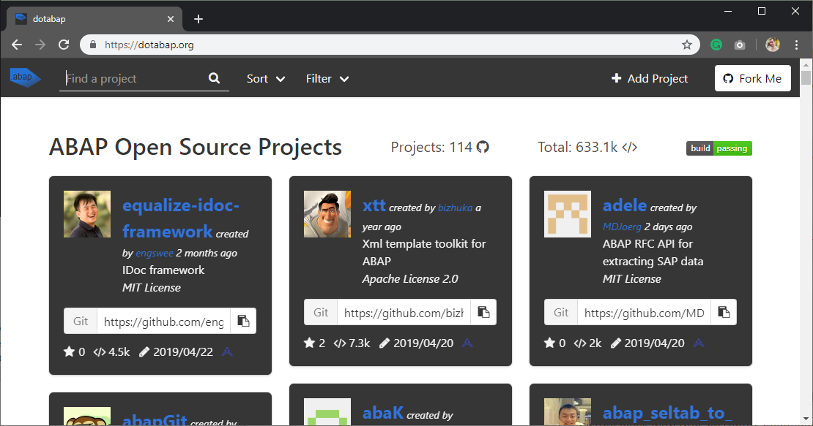

== abapGit

abapGit is a open source git client for ABAP written in ABAP. The project was https://blogs.sap.com/2014/07/17/git-client-for-abap-alpha-release/[started around 5 years ago], it has grown from being a small hobby project
to something widely used in the ABAP community.

http://abapgit.org

=== Features
From the beginning there have been 4 main design goals:

* Easy installation
* Easy upgrade
* Small system footprint
* Code readable in git repository

Which has enabled all ABAP developers to easily start getting into the world of git.
The git client can be installed on ABAP systems higher than v702 by anyone with a developer key.

The initial version supported only basic git commands with a very basic user interface, but over the years
more and more features have been added, so that it now supports the most commonly used git workflows:

....
git config usernames
git checkout
git change remote
git create branch
git change branch
git delete branch
git status
git diff
git clone
git pull
git push
git log
git commit
git patch
git reset
git add
git rm
git merge
git create tag
git change tag
git delete tag
ignore
uninstall
....

Along with serializers for https://docs.abapgit.org/ref-supported.html[more than 80 different] object types.
Customizing is supported via https://github.com/larshp/abapGit/issues/1004[Business Configuration Sets]

=== Support
All development and support for abapGit happens via normal Open Source workflows, anyone can follow or help with the development, and anyone can suggest features or report bugs.

In order to optimize abapGit and add more features the code is https://github.com/larshp/abapGit/commits/master[updated very often], and as the code is delivered as custom code, anyone with a developer key can update it
to the latest version in the development system.

In case professional support is required, then https://docs.abapgit.org/other-where-used.html[multiple customers and partners are using abapGit] and has experience with the tool.

=== Git Hosting
abapGit implements the raw git protocol from scratch transported via HTTP connections.
This makes sure it can be used with almost any git host. Connecting to modern git hosting services
enables the ABAP developer to take advantage of the tools offered by the host.

Each user can decide where and how to put the ABAP code, inside the firewalls or in the cloud.
There are many different services offered in the market:

* https://github.com/[GitHub]
* https://about.gitlab.com/[GitLab]
* https://bitbucket.org/product/[Bitbucket]
* https://azure.microsoft.com/en-us/services/devops/[Azure DevOps]
* https://aws.amazon.com/codecommit/[AWS CodeCommit]
* https://www.assembla.com/git[Assembla]
* https://github.com/larshp/abapGitServer[abapGitServer]

abapGitServer is a git server implemented in ABAP, so the code does not have to leave the application server.

=== Community
The community around abapGit has steadily grown over the years, around https://github.com/larshp/abapGit/graphs/contributors[70 developers] from the community have contributed code to abapGit, plus more have helped suggesting features or finding bugs in the source code.

Ever since the Code Exchanged was closed in 2013 it has been difficult to discover ABAP open source projects.
The "Explore" feature in abapGit helps users to find and reuse existing ABAP code from across the community, currently https://dotabap.org[dotabap.org] lists more than 100 projects totalling 600000+ lines of open source ABAP code.

The first https://wiki.scn.sap.com/wiki/display/events/abapGit+Community+Meetup[abapGit Meetup] was held in 2018,
 along with multiple talks at various past and upcoming https://wiki.scn.sap.com/wiki/display/events/SAP+Inside+Track[SAP inside tracks].
2019 also features a new community event format, https://wiki.scn.sap.com/wiki/display/events/abapGit+BunKai[abapGit Bunkai] which will take place during 2019.
